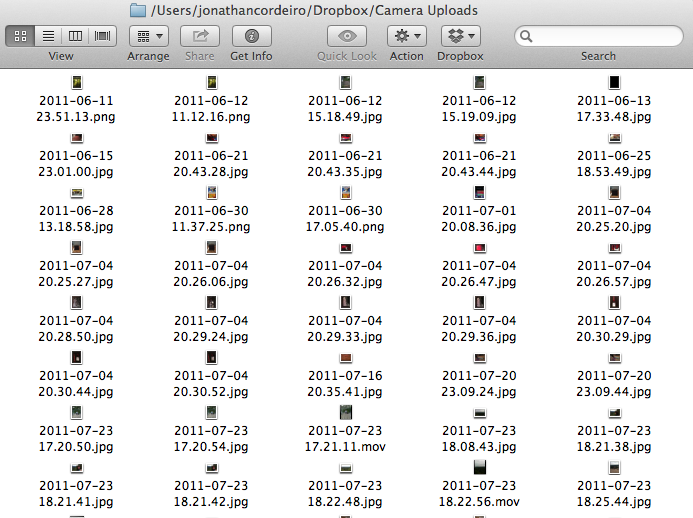
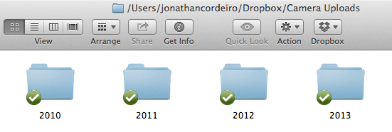

Sort-Dropbox-Camera-Upload
==========================

Dropbox has this nifty 'Camera Upload' feature that searches through your phone or camera everytime you plug it into your computer and then adds all of your new photos into a folder called 'Camera Uploads'.

The feature works great, but the problem is that over time this folder gets filled with hundreds and hundreds, or even *thousands* of photos. This can become tough to manage and makes it difficult to find photos you took a long time ago.

### The Problem ###



**This is just a small sample of the nearly 2000 pictures I had in this folder**


### The Solution ###

Frustrated with this problem, I set out to solve it myself.

Just download this script and run it in your Dropbox's Camera Uploads folder and **voila!**

```shell
Camera Uploads: $ ./sortphotos.sh

Sorting through 2010 photos and videos
No .jpg files to sort for 2010
No .png files to sort for 2010
No .mov files to sort for 2010

Sorting through 2011 photos and videos
      177 .jpg files sorted for 2011
       23 .png files sorted for 2011
       11 .mov files sorted for 2011

Sorting through 2012 photos and videos
       13 .jpg files sorted for 2012
        2 .png files sorted for 2012
        2 .mov files sorted for 2012

Sorting through 2013 photos and videos
      201 .jpg files sorted for 2013
       22 .png files sorted for 2013
        6 .mov files sorted for 2013
        
Sorting completed

```

### The Result ###

Your pictures and videos are sorted into directories based on the year you took them!



---

#### Notes ####

Since all of the photos I have stored in my Dropbox were taken by my iPhone, I built this script around the naming conventions the iPhone uses. Since the script searches and moves photos & videos based on their file name, pictures taken by other devices may not work.

Searching for pictures and videos is dependent on the file name starting with the year it was taken.
i.e 2010-01-23.jpg

As long as the file name begins with the year you would like the photo sorted by, and ends in a supported extension, the script should work.

By default .jpg, .png, and .mov files are supported, however it is easy to extend the code to allow for more file types.
Just add the file types you would like supported to [line 38 of the script](https://github.com/jcordeiro/Sort-Dropbox-Camera-Upload/blob/master/sortphotos.sh#L38).

Similarly, it is also easy to add support for years prior to 2010. Just create the directory in your Camera Uploads folder and add the year you would like supported to [line 32 of the script](https://github.com/jcordeiro/Sort-Dropbox-Camera-Upload/blob/master/sortphotos.sh#L32).

Please feel free to [send me an email](mailto:github@joncordeiro.com) or [contact me on Twitter](https://twitter.com/joncordeiro) if you have any suggestions or feedback on my code. Thanks!


